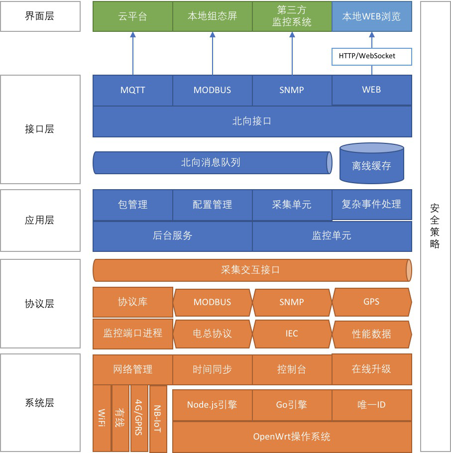

## 简介

hmu-go由三个服务组成，分别是`busserver`、`appserver`和`portserver`，分别对应网关架构系统中的接口层、应用层和协议层。服务之间的通讯方式目前使用[gRPC](https://github.com/grpc/grpc-go)。



### 接口层

进行消息处理，包括把应用层产生的数据及更上层应用下发的指令转发至应用层。目前实现包括mqtt以及web接入。

```
$ cd app/busmanger/src
$ GOOS=linux GOARCH=mipsle go build -o busserver
```

### 应用层

采集器mu实现，通过解析配置文件，启动采集单元并采集数据，同时监测控制指令，解析控制指令并发送至指定采集单元。

```
$ cd app/appmanger/src
$ GOOS=linux GOARCH=mipsle go build -o appserver
```

### 协议层

与真实硬件进行交互，包括串口通信，网络通信等等。应用层通过与协议层进行通信进行数据交互。

```
$ cd app/portmanger/src
$ GOOS=linux GOARCH=mipsle go build -o portserver
```

```
`portserver`作为rpc服务端，提供三个接口，分别为`Binding`、`Release`、`Operate`。

`Binding`：由应用层调用，在采集器启动过程中，将协议映射到设备的端口上，在之后的采集与控制中使用该协议与真实设备进行通讯。例如：端口`/dev/ttyS0`绑定协议`protocol-modbus-serial`，则在端口`/dev/ttyS0`上的采集与控制将使用`ModBus-RTU`协议。

`Release`：释放端口占用。

`Operate`：执行操作，目前定义了两种操作，分别是`Sample`以及`Command`。

在`portserver`当中定义了`PortClient`接口，真实的设备通信协议包含但不限于ModBus、SNMP、电总协议，`PortClient`定义了协议应当实现的接口。
```

### 启动

`appserver`、`busserver`以及`portserver`之间具有相互依赖，项目上使用由go语言实现的[supervisord](https://github.com/ochinchina/supervisord)进行启动及监控。

```
$ supervisord -c supervisord.conf -d
```

`supervisod.conf`内容示例：
```
[inet_http_server]
port=127.0.0.1:9001
 
[program:appserver]
command=/mnt/sda1/hmu2000/appserver -mucfg /mnt/sda1/hmu2000/monitoring-units.json -setcfg /mnt/sda1/hmu2000/index-setting.json -eldir /mnt/sda1/hmu2000/element-lib -log /mnt/sda1/hmu2000/logs/appserver.log
autostart=true

[program:busserver]
command=/mnt/sda1/hmu2000/busserver -bc /mnt/sda1/hmu2000/busmanager.json -blog /mnt/sda1/hmu2000/logs/busserver.log
autostart=true
 
[program:portserver]
command=/mnt/sda1/hmu2000/portserver -plog /mnt/sda1/hmu2000/logs/portserver.log
autostart=true
```

